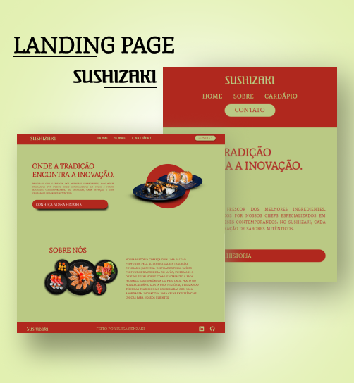

<h1 align="center"> Landing Page </h1>

Projeto de uma landing page de um restaurante de comida japonesa fictício. 

  <a href="#-tecnologias">Tecnologias</a>&nbsp;&nbsp;&nbsp;|&nbsp;&nbsp;&nbsp;
  <a href="#-projeto">Projeto</a>&nbsp;&nbsp;&nbsp;|&nbsp;&nbsp;&nbsp;

  

 

  

## 🚀 Tecnologias

Esse projeto foi desenvolvido com as seguintes tecnologias:

- HTML e CSS
- Git e Github
- Figma

## 💻 Projeto

O Projeto em questão é uma landing page referente a um estabelecimento fictício, no caso um restaurante de comida japonesa.
